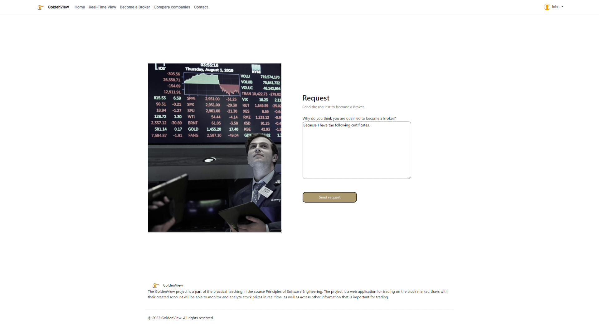

# GoldenView

<strong><i>Done by team Terminal.</i></strong>
<br/>
<br/>


## Trading Showcase Video


## Become Broker Showcase Video


## Some screenshots:





<br/>
<br/>


# Project Structure
<br/>
<pre>
GoldenView/
|
│   .gitattributes
│   .gitignore
│   README.md ( you are here ;) )
|
├───deployment
│   │   README.md
│   │
│   ├───databases
│   │
│   └───trading_platform
│       ├───compose
|       ├───config
|       ├───dockerfiles
│       └───src
|
├───development
│   │   requirements.txt (modules needed; used in venv)
│   │   README.md
│   │
│   ├───databases (physical - implementation)
│   │
│   └───trading_platform (Django project dev dir)
│       │   manage.py
│       │
│       ├───static_root (Django root folder for static content)
│       │
│       ├───trading_platform (Django project config files)
│       │
│       ├───deployment (project and local deployment automation commands)
|       |   ├────linking (automation utils for static and templates paths linkage)
|       |   └────management
│       |       └───commands (scripts for automating tasks)
│       │
|       ├───assets
|       │   ├───development (editor files, etc)
|       │   │   ├───fonts
|       │   │   ├───images
|       │   │   └───other_assets
|       │   │
|       │   └───output (exported .png, etc)
|       │       ├───fonts
|       │       ├───images
|       │       └───other_assets
|       │
│       └───apps (encapsulating independent functionalities)
|           ├───common (used across multiple apps)
|           |   └───frontend
|           |       ├───config
|           |       └───src
|           |           ├───static (e.g. js, css )
|           |           |   └───common (for clearer django naming)
|           |           |       |   favicon.ico
|           |           |       |   robots.txt
|           |           |       |
|           |           |       ├───css (used in templates of common)
|           |           |       ├───js (used in templates of common)
|           |           |       ├───images (used in templates of common)
|           |           |       ├───libs (used in templates of common)
|           |           |       └───components (html is constant, non dynamic)
|           |           |           ├───header
|           |           |           |       header.html
|           |           |           |       header.css
|           |           |           └───footer
|           |           |                   footer.html
|           |           |                   footer.css
|           |           |
|           |           └───templates
|           |               └───common  (for clearer django naming)
|           |                       base.html (template for all regular pages)
|           |
│           └───feature_app
|               │   admin.py
|               │   apps.py
|               │   models.py
|               │   tests.py
|               │   urls.py
|               │   views.py
|               │   __init__.py
|               │
|               │
|               ├───backend (server-side code)
|               │   ├───libs (for external libraries and dependencies)
|               │   └───src
|               │       ├───models
|               │       └───utils
|               │
|               ├───frontend
|               │   │
|               │   ├───config (configuring code variables, e.g. endpoints urls)
|               │   │
|               │   └───src (html, views, etc)
|               |       ├───static (contains literally nothing dynamic)
|               |       |   └───common (for clearer django naming)
|               |       |       |   favicon.ico
|               |       |       |   robots.txt
|               |       |       |
|               |       |       ├───css (used in templates of common)
|               |       |       ├───js (used in templates of common)
|               |       |       ├───images (used in templates of common)
|               |       |       ├───libs (used in templates of common)
|               |       |       └───components (html is constant, non dynamic)
|               |       |           └───button (for example)
|               |       |                   button.html
|               |       |                   button.css
|               │       │
|               │       └───templates
|               │           └───landing_page (for example)
|               │                   landing_page.html
|               │                   landing_page.css
|               │
|               └───migrations
│
├───documentation
│   │   environment-setup.md
│   │
│   ├───features_specs (main project file and specs of use case scenarios)
│   │
│   ├───databases (logical - models)
│   │   ├───development (prototypes, editor files, etc)
│   │   └───output (db models being used in the implementation)
│   │
│   ├───uml_diagrams ( the good stuff ;) )
│   │
│   └───ideas (final stuff from WhatsApp that is agreed upon)
│           design.docx
│           features.docx
│           tech_stack.docx
|
└───testing
    ├───backend
    │   ├───integration
    │   └───unit
    │
    ├───e2e (end to end, from user perspective)
    │
    └───frontend
        ├───ui
        └───unit

</pre>

<br/><br/>
# Gerrit Workflow Guidelines

## Rules

- Only the `master` branch is used as the long-lived branch.
- Before starting any new task, make sure your `master` branch is up-to-date.
- Commit often and with descriptive commit messages.
- Changes are submitted for review using Gerrit here:<br/>https://crete.etf.bg.ac.rs/dashboard/self

## Workflow

### Working on a new feature or bug fix

1. Pull the latest changes from the `master` branch: `git pull --rebase origin master`.
2. Work on the `master` branch and make frequent commits.
3. When you're ready to submit your changes for review, push your branch to the remote repository using Gerrit: `git push origin HEAD:refs/for/master`.
4. Open Gerrit in your web browser and navigate to your change request:<br/>https://crete.etf.bg.ac.rs/dashboard/self
5. Add reviewers and wait for their feedback.
6. Make any necessary changes based on the feedback and amend your commits.
7. Push the changes again to update the existing change request: `git push origin HEAD:refs/for/master`. To create the changes before pushing:
    - Make the necessary changes to your code.
    - Stage the modified files using `git add` for the specific files you've modified.
    - Commit your changes, if changes are not substantial and do not
      require new commit message you can just run:
      `git commit --amend --no-edit`
    - Do not forget to push when ready for re-review.
8. Once the change is approved, it can be merged into the `master` branch.


## Logging in to Contribute

To perform a push to remote you need to be logged in as the user that has the permissions on the website: https://crete.etf.bg.ac.rs/dashboard/self
<br/>
**The following setup steps 1, 2 and 3 should be the first thing to do when starting the work on the project. Clone the project after performing them.**
<br/>

### Git Configuration for a Specific Repository

If you want to set the Git configuration non globally, for this repo only, follow these instructions:

0. **Performing a push for first time per generated SSH key**
    - **Make sure that you only have authorized accounts' email addresses in commits of your git log history (this may be true if the following setup was not your first step of working on the project; in that case you can first perform the setup, then just clone again, then commit, then push)**
    - When performing a push it may say something like:<br/>
      `
      remote: Unauthorized
      fatal: Authentication failed for 'https://crete.etf.bg.ac.rs/project_Terminal/'
      `<br/>
      In that case perform the steps 1, 2 and 3 and you will be prompted to enter the `username` and `password` which are the `username` and `SSH key(password)` ***both listed*** in the HTTP Credentials section here:<br/>https://crete.etf.bg.ac.rs/settings/#HTTPCredentials

1. **Generate SSH key to enter the password through git**:
    - Go to: https://crete.etf.bg.ac.rs/settings/#HTTPCredentials
    - Under HTTP Credentials click on GENERATE NEW PASSWORD
    - You will need the generated password in next step

2. **Set Git config**:
   - Open a terminal or command prompt.
   - Navigate to the Git repository for which you want to set the configuration.
   - When you are performing this step before cloning make sure to be in a folder that you called `git init` inside so there is a local config to setup. Then inside the cloned dir perform these steps again and then you can remove the `.git` that is outside your cloned/project dir.
   - Use the following command to set your username locally:
     ```
     git config user.name "Your Full Name"
     ```
   - Use the following command to set your email address locally:
     ```
     git config user.email "piGGBBBBd@student.etf.bg.ac.rs"
     ```
   - Replace `Your Full Name` with your full name and `piGGBBBB@student.etf.bg.ac.rs` with your student email address.
   - `Your Full Name` will only be the displayed name in git log history and is not related to account credentials.

3. **Verify local Git config**:
   - To verify that the local Git config has been set correctly, you can use the following command:
     ```
     git config user.email
     ```
      This should display your student email address. You can check the `user.name` like that as well, but it does not affect your login just represents your name in the git log.


By following these instructions and setting the Git config locally, the configuration will only apply to the specific repository where you executed the `git config` commands. Other repositories will not be affected by this configuration.


## Cloning the Repo

**Before doing this make sure to perform the steps in ***Logging in to Contribute*** section.**

**The git clone command can be found here:**
https://crete.etf.bg.ac.rs/admin/repos/project_Terminal,general

**If the git clone command logs that there was ***any*** kind of error delete what was downloaded. In that case on Windows you can try:**

1. In case of error message `The syntax of the command is incorrect.` or out of sheer desperation try the following.
    ```
    git clone "https://crete.etf.bg.ac.rs/project_Terminal" & (cd "project_Terminal" & mkdir -p .git\hooks & curl -Lo .git\hooks\commit-msg https://crete.etf.bg.ac.rs/tools/hooks/commit-msg & attrib +x .git\hooks\commit-msg)
    ```
2. Only if the option 1. did not work because curl failed due to our college's dumb SSL try this:
    ```
    git clone "https://crete.etf.bg.ac.rs/project_Terminal" & (cd "project_Terminal" & mkdir -p .git\hooks & curl -Lo .git\hooks\commit-msg --insecure https://crete.etf.bg.ac.rs/tools/hooks/commit-msg & attrib +x .git\hooks\commit-msg)
    ```


<br/><br/>
# GitFlow Workflow Guidelines


## Rules

- Only main and develop branches are long lived. All other labels should be cleared once done.
- Never work directly on `develop` or `main` branches.
- Do not ever merge into `main` directly from branches other than `release` or `hotfix` _types_ of branches.
- Before starting any new feature, make sure your `develop` branch is up-to-date with the latest changes from `main`.
- Use clear and descriptive branch names, such as `feature/my-new-feature` or `hotfix/bug-fix`.
- Commit often and with descriptive commit messages.
- Once `develop` is considered ready for release but was not yet entirely tested then according `release` branch <br/>
  is to be created where the software gets tested, and if found ready for release then that `release` branch is <br/>
  to be merged into `main` and back into `develop` and then deleted.

## Workflow

### Working on a new feature

1. Pull the latest changes from the `develop` branch: `git pull origin develop`
2. Create a new feature branch: `git checkout -b feature/my-new-feature`
3. Work on your feature branch and make frequent commits.
4. When you're done, push your feature branch to the remote repository: `git push -u origin feature/my-new-feature`
5. Open a pull request on GitHub and assign someone to review your code.
6. Once your pull request is approved, merge your feature branch into `develop` on GitHub.
7. Delete your feature branch.

### Making a hotfix

1. Create a new hotfix branch from the latest `main` branch
2. Work on your hotfix branch and make frequent commits.
3. When you're done, push your hotfix branch to the remote repository: `git push -u origin hotfix/bug-fix`
4. Open a pull request on GitHub and assign someone to review your code.
5. Once your pull request is approved, merge your hotfix branch into `main` on GitHub.
6. Once your pull request is approved, merge your hotfix branch into `develop` on GitHub.
7. Delete your hotfix branch.
